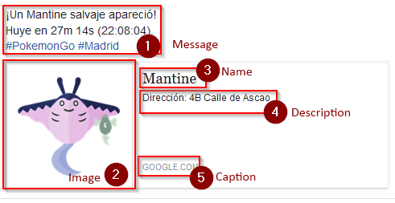

Facebook Pages
=====================================

.. contents:: Table of Contents
   :depth: 2
   :local:

Prerequisites
-------------------------------------

This guide assumes

+ You are familiar with `JSON formatting <https://www.w3schools.com/js/js_json_intro.asp>`_.
+ You have read and understood the :doc:`index` wiki.
+ You are comfortable with the layout of ``alarms.json``.
+ You are using the latest version of PokeAlarm.

Please familiarize yourself with all of the above before proceeding.

Introduction
-------------------------------------

**Facebook Pages** is an online social networking service that enables users to
post status messages to a public profile specifically created for business,
brands, celebrities, causes, and other organizations. Registered users can read
and post messages, but those who are unregistered can only read them. Users
access Facebook through the website interface, SMS or mobile device app.

PokeAlarm offers the following for Facebook Pages:

+ Personalized notifications via :doc:`../events/index`

Basic Config
-------------------------------------

Required Parameters
~~~~~~~~~~~~~~~~~~~~~~~~~~~~~~~~~~~~~

These ``alarms.json`` parameters - ``active``, ``type``, and ``page_access_token`` -
are required to enable the Facebook Pages alarm service:

================= =====================================
Parameters        Description
================= =====================================
type              Must be ``"facebook_page"``
active            ``true`` for alarm to be active
page_access_token Your permanent FB page access token
================= =====================================

Example: Basic Alarm Configuration using Required Parameters
~~~~~~~~~~~~~~~~~~~~~~~~~~~~~~~~~~~~~

.. code-block:: json

  {
  	"active":true,
  	"type":"facebook_page",
  	"page_access_token":"YOUR_PAGE_ACCESS_TOKEN"
  }

.. note::
  The above code is to be inserted into the alarms section of
  alarms.json. It does not represent the entire alarms.json file.

Advanced Config
-------------------------------------

Optional Parameters
~~~~~~~~~~~~~~~~~~~~~~~~~~~~~~~~~~~~~

In addition to the 3 required parameters, several optional parameters are
available to personalize your Facebook Pages notifications. Below is an
example of these optional parameters and how they are incorporated into a
functional alarm layout for Facebook Pages.

These optional parameters are entered at the same level as ``"type":"facebook_page"``.

+-------------------+-----------------------------------------------+----------+
| Parameters        | Description                                   | Default  |
+-------------------+-----------------------------------------------+----------+
| `startup_message` | Confirmation post when PokeAlarm initialized  | ``true`` |
+-------------------+-----------------------------------------------+----------+

These optional parameters below are applicable to the ``monsters``, ``stops``,
``gyms``, ``eggs``, and ``raids`` sections of the JSON file. Check Image column to
see where everything appears in the final publication.

=============== =============================================== ======
Parameters      Description                                     Image
=============== =============================================== ======
`message`       Message to post as status message               1
`link`          Link to be added to notification text           Link
`image`         Url of the image to show as a preview (empty    2
                for linked page preview)
`name`          Link title (empty for linked page title)        3
`description`   Link description (empty for blank description)  4
`caption`       Link domain (empty for linked page domain)      5
=============== =============================================== ======

When it says ``"empty for X"`` it means that you can disable the default
PokeAlarm value setting that parameter to ``""`` in your ``alarms.json`` file.
In that case Facebook will use the link information to fill that field in the
publication.

For example if you have ``link`` as a google maps link and you disable the
``image`` parameter setting it to ``""``, it will be a minimap image of that
coordinates.

``monsters`` default values:

=============== ===============================================
Parameters      Default
=============== ===============================================
`message`       ``A wild <mon_name> has appeared!``
`image`
`link`          ``<gmaps>``
`name`          ``<mon_name>``
`description`   ``Available until <24h_time> (<time_left>)``
`caption`       None
=============== ===============================================

``stops`` default values:

=============== ===============================================
Parameters      Default
=============== ===============================================
`message`       ``Someone has placed a lure on a Pokestop!``
`image`
`link`          ``<gmaps>``
`name`          ``Lured Pokestop``
`description`   ``Lure will expire at <24h_time> (<time_left>)``
`caption`       None
=============== ===============================================

``gyms`` default values:

=============== =====================================
Parameters      Default
=============== =====================================
`message`       ``A Team <old_team> gym has fallen!``
`image`
`link`          ``<gmaps>``
`name`          ``<old_team> gym fallen``
`description`   ``It is now controlled by <new_team>``
`caption`       None
=============== =====================================

``eggs`` default values:

============== =======================================================
Parameters     Default
============== =======================================================
`message`      ``A level <egg_lvl> raid is upcoming!``
`image`
`link`         ``<gmaps>``
`name`         ``Egg``
`description`  ``A level <egg_lvl> raid will hatch at <24h_hatch_time>
               (<hatch_time_left>).``
`caption`      None
============== =======================================================

``raids`` default values:

=============== =======================================================
Parameters      Default
=============== =======================================================
`message`       ``Level <raid_lvl> raid available against <mon_name>!``
`image`
`link`          ``<gmaps>``
`name`          ``Raid``
`description`   ``The raid is available until <24h_raid_end>
                (<raid_time_left>).``
`caption`       None
=============== =======================================================

Example: Alarm Configuration Using Optional Parameters
~~~~~~~~~~~~~~~~~~~~~~~~~~~~~~~~~~~~~

.. code-block:: json

  {
    "facebook_alarm":{
      "active":true,
      "type":"facebook_page",
      "page_access_token":"YOUR_PAGE_ACCESS_TOKEN",
      "startup_message":false,
      "monsters":{
          "message":"<mon_name> available. <quick_move>/<charge_move> (<iv>% - <atk>/<def>/<sta>)",
          "image*":"<YOUR CUSTOM URL HERE>/<mon_id_3>_<form_id_3>.png",
          "link":"<gmaps>",
          "description":"Address: <address>",
          "name":"<mon_name>"
      },
      "stops":{
          "message":"Someone has placed a lure on a Pokestop! Lure will expire at <24h_time> (<time_left>).",
          "image*":"<YOUR CUSTOM URL HERE>/ready.png",
          "description":"Address: <address>",
          "link":"<gmaps>",
          "name":""
      },
      "gyms":{
          "message":"A Team <old_team> gym has fallen! It is now controlled by <new_team>.",
          "image*":"<YOUR CUSTOM URL HERE>/<new_team_id>.png",
          "link":"<gmaps>",
          "name":"<new_team>",
          "description":"Address: <address>"
      },
      "eggs":{
          "message":"A level <egg_lvl> raid is upcoming!",
          "image*":"<YOUR CUSTOM URL HERE>/<egg_lvl>.png",
          "link":"<gmaps>",
          "name":"Egg",
          "description":"A level <egg_lvl> raid will hatch at <24h_hatch_time> (<hatch_time_left>)."
      },
      "raids":{
          "message":"Level <raid_lvl> raid available against <mon_name>!",
          "image*":"<YOUR CUSTOM URL HERE>/<mon_id_3>_000.png",
          "link":"<gmaps>",
          "name":"Raid",
          "description":"The raid is available until <24h_raid_end> (<raid_time_left>)."
      }
    }
  }

.. note::
  \*THESE LINES ARE USED TO OVERRIDE DEFAULT VALUES. IF YOU DO NOT WISH
  TO USE CUSTOM IMAGES, DO NOT ADD THESE LINES TO YOUR ALARMS.JSON.

  The above code is to be inserted into the alarms section of
  alarms.json. It does not represent the entire alarms.json file.

How to get a Permanent Facebook Page Token
-------------------------------------

Use the `Graph API Explorer <https://developers.facebook.com/tools/explorer>`_
for all of these steps except where otherwise stated.

**0. Create Facebook App**

**If you already have an app**, skip to step 1.

1. Go to `My Apps <https://developers.facebook.com/apps/>`_.
2. Click ``+ Add a New App``.
3. Setup a website app.
4. Go to App Review of your new app and make sure your app is made Public.

**1. Get User Short-Lived Access Token**

1. Go to the `Graph API Explorer <https://developers.facebook.com/tools/explorer>`_.
2. Select the application you want to get the access token for by clicking on
   the ``Graph API Explorer`` dropdown near the top right.
3. Click ``Get Token`` dropdown and choose ``Get User Access Token``.
4. In the pop-up, under the ``Events, Groups & Pages`` section, check
   ``manage_pages`` and ``publish_pages``.
5. Click ``Get Access Token``.
6. Grant access from a Facebook account that has access to manage the target
   page. Note that if this user loses access the final, never-expiring access
   token will likely stop working.

Token that appears in the ``Access Token`` field is your short-lived access token.

**2. Generate Long-Lived Access Token**

Following `these instructions <https://developers.facebook.com/docs/facebook-login/access-tokens#extending>`_
from the Facebook docs, make a GET request to

``https://graph.facebook.com/v2.2/oauth/access_token?grant_type=fb_exchange_token&client_id={app_id}&client_secret={app_secret}&fb_exchange_token={short_lived_token}``

entering in your app's ID and secret, generated from step 0, and the
short-lived token, generated in the previous step. Be sure to remove the curly
braces ``{}`` when replacing values.

You **cannot use the Graph API Explorer**. For some reason it gets stuck on
this request. I think it's because the response isn't JSON, but a query string.
Since it's a GET request, you can just go to the URL in your browser.

The response should look like this:

``access_token=ABC123&expires=5182959``

``ABC123`` will be your long-lived access token. You can put it into the
`Access Token Debugger <https://developers.facebook.com/tools/debug/accesstoken>`_
to verify.
Under ``Expires`` it should have something like ``2 months``.

**3. Get User ID**

Using the long-lived access token, make a GET request to

``https://graph.facebook.com/v2.2/me?access_token={long_lived_access_token}``

Be sure to remove the curly braces ``{}`` when replacing values. The **id** field
is your account ID. You'll need it for the next step.

**4. Get Permanent Page Access Token**

Make a GET request to

``https://graph.facebook.com/v2.2/{account_id}/accounts?access_token={long_lived_access_token}``

Be sure to remove the curly braces ``{}`` when replacing values. The JSON
response should have a **data** field under which is an array of items the user
has access to. Find the item for the page you want the permanent access token
from. The **access_token** field should have your permanent access token. Copy
it and test it in the `Access Token Debugger <https://developers.facebook.com/tools/debug/accesstoken>`_.
Under ``Expires`` it should say ``Never``.
