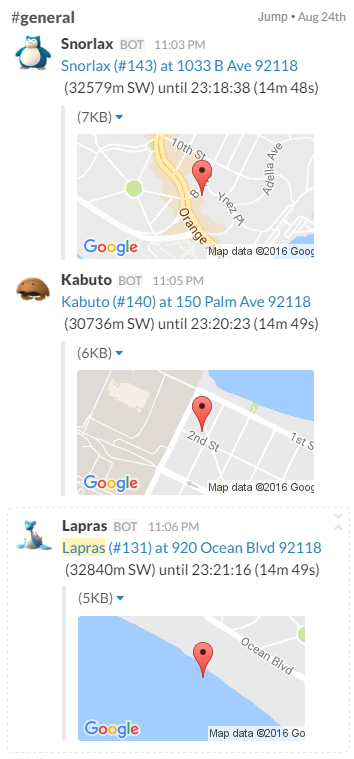
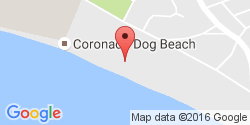

Slack
=====================================

.. contents:: Table of Contents
   :depth: 2
   :local:

Prerequisites
-------------------------------------

This guide assumes

+ You are familiar with `JSON formatting <https://www.w3schools.com/js/js_json_intro.asp>`_.
+ You have read and understood the :doc:`index` wiki.
+ You are comfortable with the layout of ``alarms.json``.
+ You are using the latest version of PokeAlarm.

Please familiarize yourself with all of the above before proceeding.

Introduction
-------------------------------------

**Slack** is a cloud-based team collaboration tool that is available on
Windows, Mac OS X, Linux, iOS, Android, and Windows Phone. Slack offers a lot
of IRC-like features: persistent chat rooms (channels) organized by topic, as
well as private groups and direct messaging. All content inside Slack is
searchable, including files, conversations, and people.

PokeAlarm offers the following for Slack:

+ Custom username for posting
+ High resolution icons for pokemon, gym, pokestop, egg and/or raid notifications
+ Notifications to multiple Slack channels and/or teams
+ Customizable Google Map image of the pokemon, gym, pokestop, egg and/or raid location
+ Personalized notifications via :doc:`../events/index`

Basic Config
-------------------------------------

Required Parameters
~~~~~~~~~~~~~~~~~~~~~~~~~~~~~~~~~~~~~

These parameters below are required to enable the Slack alarm service:

============ =============== ======================================
Parameters   Default         Description
============ =============== ======================================
`type`       ``"slack"``     Name of service
`active`     ``false``       ``true`` for alarm to be active
`api_key`                    Your Slack API key
`channel`    ``"general"``   Default channel to post notifications
============ =============== ======================================

Example: Basic Alarm Configuration using Required Parameters
~~~~~~~~~~~~~~~~~~~~~~~~~~~~~~~~~~~~~

.. code-block:: json

  {
  	"active":true,
  	"type":"slack",
  	"api_key":"YOUR_API_KEY",
  	"channel":"general"
  }

.. note::
  The above code is to be inserted into the alarms section of
  alarms.json. It does not represent the entire alarms.json file.

Advanced Config
-------------------------------------

Optional Parameters
~~~~~~~~~~~~~~~~~~~~~~~~~~~~~~~~~~~~~

In addition to the 3 required parameters, several optional parameters are
available to personalize your Slack notifications. Below is an example of
these optional parameters and how they are incorporated into a functional
alarm layout for Slack.

These optional parameters are entered at the same level as ``"type":"slack"``.

+-------------------+-----------------------------------------------+----------+
| Parameters        | Description                                   | Default  |
+-------------------+-----------------------------------------------+----------+
| `startup_message` | Confirmation post when PokeAlarm initialized  | ``true`` |
+-------------------+-----------------------------------------------+----------+

These optional parameters below are applicable to the ``monsters``, ``stops``,
``gyms``, ``eggs``, and ``raids`` sections of the JSON file.

============= ============================================ ===========================================
Parameters    Description                                  Default
============= ============================================ ===========================================
`channel`     Send messages to this channel                ``#general``
`username`    Username the bot should post the message     ``<mon_name>``
`icon_url`    URL path to pokemon icon
`title`       Notification text to begin the message       ``A wild <mon_name> has appeared!``
`url`         Link to be added to notification text        ``<gmaps>``
`body`        Additional text to be added to the message   ``Available until <24h_time> (<time_left>).``
`map`         Specify a json object to describe the map    See Mini Map Configuration for more details
============= ============================================ ===========================================

.. note::
  Nidorans will be ``nidoranf`` or ``nidoranm``, Farfetch'd will be
  ``farfetchd``, and Mr. Mime will be ``mrmime``.
  Channels that do not exist (channels cannot be created by bots) will
  default to general instead.

Example: Alarm Configuration Using Optional Parameters
~~~~~~~~~~~~~~~~~~~~~~~~~~~~~~~~~~~~~

.. code-block:: json

  {
    "slack_alarm":{
      "active":true,
      "type":"slack",
      "api_key":"YOUR_API_KEY",
      "channel":"general",
      "startup_message":true,
      "monsters":{
          "channel":"general",
          "username":"<mon_name>",
          "icon_url*":"<YOUR CUSTOM URL HERE>/<mon_id_3>_<form_id_3>.png",
          "title":"A wild <mon_name> has appeared!",
          "url":"<gmaps>",
          "body":"Available until <24h_time> (<time_left>).",
          "map":{
              "enabled":true,
              "width":"250",
              "height":"125",
              "maptype":"roadmap",
              "zoom":"15"
          }
      },
      "stops":{
          "channel":"general",
          "username":"Pokestop",
          "icon_url*":"<YOUR CUSTOM URL HERE>/ready.png",
          "title":"Someone has placed a lure on a Pokestop!",
          "url":"<gmaps>",
          "body":"Lure will expire at <24h_time> (<time_left>)."
      },
      "gyms":{
          "channel":"general",
          "username":"<new_team> Gym Alerts",
          "icon_url*":"<YOUR CUSTOM URL HERE>/<new_team_id>.png",
          "title":"A Team <old_team> gym has fallen!",
          "url":"<gmaps>",
          "body":"It is now controlled by <new_team>."
      },
      "eggs":{
          "username":"Egg",
          "icon_url*":"<YOUR CUSTOM URL HERE>/<egg_lvl>.png",
          "title":"A level <egg_lvl> raid is incoming!",
          "url":"<gmaps>",
          "body":"The egg will hatch <24h_hatch_time> (<hatch_time_left>)."
      },
      "raids":{
          "username":"<mon_name> Raid",
          "icon_url*":"<YOUR CUSTOM URL HERE>/<mon_id_3>_000.png",
          "title":"Level <raid_lvl> raid is available against <mon_name>!",
          "url":"<gmaps>",
          "body":"The raid is available until <24h_raid_end> (<raid_time_left>)."
      }
    }
  }

.. note::
  \*THESE LINES ARE USED TO OVERRIDE DEFAULT VALUES. IF YOU DO NOT
  WISH TO USE CUSTOM IMAGES, DO NOT ADD THESE LINES TO YOUR ALARMS.JSON.

  The above code is to be inserted into the alarms section of
  alarms.json. It does not represent the entire alarms.json file.

Mini Map Configuration
~~~~~~~~~~~~~~~~~~~~~~~~~~~~~~~~~~~~~

You can enable a small Google Static Maps image after your post, showing the
location of the alarmed pokemon, gym, pokestop, egg or raid. This is done by
adding the `map` parameter at the Alarm level (which will apply maps for any
notification), or individually to the ``monsters``, ``stops``, ``gyms``, ``eggs``, or
``raids`` sections of your alarm.

Below is an example of enabling the mini map for pokemon:

.. code-block:: json

	"monsters":{
		"channel":"general",
		"username":"<mon_name>",
		"title":"A wild <mon_name> has appeared!",
		"url":"<gmaps>",
		"body":"Available until <24h_time> (<time_left>).",
		"map":{
			"enabled":true,
			"width":"250",
			"height":"125",
			"maptype":"roadmap",
			"zoom":"15"
		}
	},

=============== ========================================== ============
Parameters      Description                                Default
=============== ========================================== ============
`enabled`       Turns the map on or off                    ``true``
`width`         Width of the map                           ``"250"`` px
`height`        Height of the map                          ``"150"`` px
`maptype`       Link to be added to notification text      ``"roadmap"``
`zoom`          Specifies the zoom of the map              ``"15"``
=============== ========================================== ============

Formatting alarms text
~~~~~~~~~~~~~~~~~~~~~~~~~~~~~~~~~~~~~

Here is a basic guide to apply custom styles to alarm text:

================================ =============================
Style                            Example
================================ =============================
`_italics_`                      *italics*
`*bold*`                         **bold**
`_*bold italics*_`               :boltitalic:`bold italics`
`~strikethrough~`                :strike:`strikethrough`
================================ =============================

You can see other options in the official Slack information about formatting
text `here <https://get.slack.help/hc/en-us/articles/202288908-Format-your-messages>`_.

How to get a Slack API Key
-------------------------------------

1. Visit `slack.com <https://www.slack.com>`_. Enter your email address and
   click ``Create your team``. Follow the instructions to setup and activate
   your account.

2. Go to the `create a bot page <https://my.slack.com/services/new/bot>`_. Enter
   a username and click create.

3. Copy the API Token given. Fill out any more information you want, and click
   ``Save Integration``.
