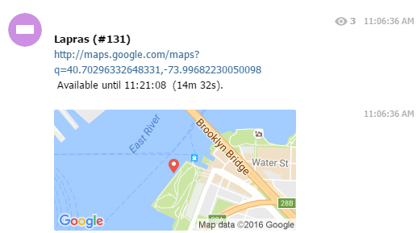

Telegram
=====================================

.. contents:: Table of Contents
   :depth: 2
   :local:

Prerequisites
-------------------------------------

This guide assumes

+ You are familiar with `JSON formatting <https://www.w3schools.com/js/js_json_intro.asp>`_.
+ You have read and understood the :doc:`index` wiki.
+ You are comfortable with the layout of ``alarms.json``.
+ You are using the latest version of PokeAlarm.

Please familiarize yourself with all of the above before proceeding.

Introduction
-------------------------------------

**Telegram** is a cloud-based instant messaging service. Telegram clients exist
for both mobile (Android, iOS, Windows Phone, Ubuntu Touch) and desktop systems
(Windows, OS X, Linux). Users can send messages and exchange photos, videos,
stickers and files of any type.

PokeAlarm offers the following for Telegram:

+ Notifications to multiple Telegram channels
+ Customizable Google Map image of the pokemon, gym, pokestop, egg and/or raid location
+ Personalized notifications via :doc:`../events/index`

Basic Config
-------------------------------------

Required Parameters
~~~~~~~~~~~~~~~~~~~~~~~~~~~~~~~~~~~~~

These ``alarm.json`` parameters are required to enable the Telegram alarm service:

=============== ===================================
Parameters      Description
=============== ===================================
`type`          Must be ``"telegram"``
`active`        ``true`` for alarm to be active
`bot_token`     Your Bot Token from Telegram
`chat_id`       Your chat's id from Telegram
=============== ===================================

Example: Basic Alarm Configuration using Required Parameters
~~~~~~~~~~~~~~~~~~~~~~~~~~~~~~~~~~~~~

Below is how a basic Telegram alarm configuration would appear in
``alarms.json``. Note that this is **not** the entire ``alarms.json``, but only
the section pertaining to the alarm portion of the JSON file.

.. code-block:: json

  {
  	"active":true,
  	"type":"telegram",
  	"bot_token":"YOUR_BOT_TOKEN",
  	"chat_id":"YOUR_CHAT_ID"
  }

Advanced Config
-------------------------------------

Optional Parameters
~~~~~~~~~~~~~~~~~~~~~~~~~~~~~~~~~~~~~

In addition to the required parameters, several ``alarms.json`` optional
parameters are available to personalize your notifications. Below is an example
of these optional parameters and how they are incorporated into a functional
alarm layout.

Parameters at the alarm level will be the default to alert-level parameters.

================= ====================================================== ============
Parameters        Description                                            Default
================= ====================================================== ============
`map`             Sends minimap after main message.                      ``true``
`map_notify`      Disables map notifications. Set to ``false`` if you
                  are experiencing notification issues on Android        ``false``
`venue`           Sends location in main message.*                       ``false``
`venue_notify`    Disables venue notifications. Set to ``false`` if you
                  are experiencing notification issues on Android        ``true``
`message_notify`  Enables notifications messages                         ``true``
`sticker`         Sends pokemon images as stickers in the message        ``true``
`sticker_notify`  Disables sticker notifications. Set to ``false``
                  if you are experiencing notification issues on Android ``false``
`sticker_url`     Url to be used for the sticker. Must be .webp file.
`max_attempts`    Max attempts to send for each message.                 ``"3"``
`web_preview`     Enables web preview for links in message.              ``false``
`startup_message` Confirmation post when PokeAlarm initialized           ``true``
================= ====================================================== ============

These optional parameters below are applicable to the ``monsters``, ``stops``,
``gyms``, ``eggs``, and ``raids`` sections of the JSON file. These parameters
override the alarm-level settings for this alert.

================ ========================================= ============================
Parameters       Description                               Default
================ ========================================= ============================
`message`        Text for the message                      ``"*A wild <mon_name> has
                                                           appeared!*\nAvailable until
                                                           <24h_time> (<time_left>)."``
`map`            Sends minimap after main message.         ``true``
`map_notify`     Disables map notifications. Set to
                 ``false`` if you are experiencing
                 notification issues on Android            ``false``
`venue`          Sends location in main message.*          ``false``
`venue_notify`   Disables venue notifications. Set to
                 ``false`` if you are experiencing
                 notification issues on Android            ``true``
`sticker`        Sends images as stickers in the message   ``true``
`sticker_notify` Disables sticker notifications. Set to
                 ``false`` if you are experiencing
                 notification issues on Android            ``false``
================ ========================================= ============================

.. note::
  \*if you use ``venue``, keep in mind that the markdown in your alarms
  will be ignored because of a limitation in the Telegram API.

Example: Alarm Configuration Using Optional Parameters
~~~~~~~~~~~~~~~~~~~~~~~~~~~~~~~~~~~~~

Below is how an advanced alarm configuration would appear in ``alarms.json``.
Note that this is **not** the entire ``alarms.json``, but only the section
pertaining to the alarm portion of the JSON file.

.. code-block:: json

  {
    "telegram_alarm":{
      "active":true,
      "type":"telegram",
      "bot_token":"YOUR_BOT_TOKEN",
      "chat_id":"YOUR_CHAT_ID",
      "map_notify":false,
      "startup_message":false,
      "sticker":true,
      "monsters":{
          "chat_id":"OVERRIDES_DEFAULT_CHANNEL",
          "message":"*A wild <mon_name> has appeared!*\nAvailable until <24h_time> (<time_left>).",
          "map":true
      },
      "stops":{
          "chat_id":"OVERRIDES_DEFAULT_CHANNEL",
          "message":"*Someone has placed a lure on a Pokestop!*\nLure will expire at <24h_time> (<time_left>).",
          "map":true
      },
      "gyms":{
          "chat_id":"OVERRIDES_DEFAULT_CHANNEL",
          "message":"*A Team <old_team> gym has fallen!*\nIt is now controlled by <new_team>.",
          "map":true
      },
      "eggs":{
          "chat_id":"OVERRIDES_DEFAULT_CHANNEL",
          "message":"*A level <egg_lvl> raid is incoming!*\nThe egg will hatch <24h_hatch_time> (<hatch_time_left>).",
          "map":true
      },
      "raids":{
          "chat_id":"OVERRIDES_DEFAULT_CHANNEL",
          "message":"*A raid is available against <mon_name>!*\nThe raid is available until <24h_raid_end> (<raid_time_left>).",
          "map":true
      }
    }
  }

Formatting alarms text
~~~~~~~~~~~~~~~~~~~~~~~~~~~~~~~~~~~~~

Here is a basic guide to apply custom styles to alarm text:

============================= =============================
Style                         Example
============================= =============================
`_italic text_`               *italics*
`*bold text*`                 **bold**
`_*bold italics*_`            :boltitalic:`bold italics`
============================= =============================

You can see other options in the official Telegram information about
formatting text `here <https://core.telegram.org/bots/api#formatting-options>`_.

How to get a Telegram API Key
-------------------------------------

1. Go to `Telegram Web Client <https://telegram.org/dl/webogram>`_. Enter your
   phone number and follow the instructions to create your account.

2. Talk to the `BotFather <https://telegram.me/botfather>`_ to create a new bot.
   Use the ``/newbot`` command and follow his instructions. It will give you an
   API Token when you are finished.

3. Start a conversation with your bot. In the top left click on the menu bars,
   then click create group. Type in the name of the bot you previously created,
   then click on it when it appears below. Then click next. Type any message to
   your bot.

4. Enter your bot_token in to replace the ``<BOT_TOKEN_HERE>`` in the following
   url ``https://api.telegram.org/bot<BOT_TOKEN_HERE>/getUpdates``. Then go to
   it, and find the section that says ``"chat":{"id":<CHAT_ID>``. This number
   is your chat_id.

How to Create a Custom Channel
-------------------------------------

1. Create a Public Channel (Currently doesn't work from the web app).

2. Add your bot as an administrator for the channel.

3. The chat_id for your bot will be `@channel_url`.
