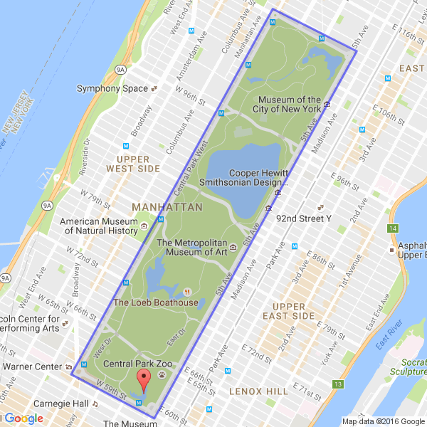

Geofences
=====================================

.. contents:: Table of Contents
   :depth: 2
   :local:

Prerequisites
-------------------------------------

This guide assumes the following:

+ You are using the latest version of PokeAlarm.
+ You understand how :doc:`filters/index` work.
+ You understand how :doc:`managers` work.

Introduction
-------------------------------------

A **Geofence** is a geographic boundary, described as a polygon formed by a
series of points. Each point is represented by coordinates of latitude and
longitude. For example, this is a geofence that surrounds Central Park:

Defining Geofences
-------------------------------------

Each Geofence is composed of a name and a list of points. The first line of the
description must be the name, surrounded by square brackets. The points of the
Geofence follow, each as a pair of coordinates on a separate line. The Geofence
around Central Park would be described as follows:

.. code-block:: none

    [Central Park]
    40.801206,-73.958520
    40.767827,-73.982835
    40.763798,-73.972808
    40.797343,-73.948385

In this case, the name is ``Central Park`` and it has 4 points, one for each
corner of the park. There are no limits on how big your geofence can be, but do
note that additional points may require increase processing time.

If using multiple geofences, they must be listed consecutively, with no empty
spaces.

Filtering on Geofences
-------------------------------------

.. note:: In order to filter by a geofence, you must load a file describing
          your geofences. See the :doc:`managers` page for specifics.

Using the ``"geofence"`` restriction, you can filter events by requiring them to
be located inside one of the geofences you have defined:

.. code-block:: json

    "geofence example": {
        "geofence": [ "Central Park", "Geofence #2", "Geofence #3" ]
    }

.. note:: An event is only compared to a Geofence if it is listed in the
          filter. This means that PA does not waste time checking unlisted
          geofences, but also means the `<geofence>` DTS doesn't work unless
          you have a geofence restriction specified.

You can also use the ``"all"`` shortcut, if you have a large number of
geofences and find it cumbersome to list them all. It is equivalent to listing
every Geofence attached to a Manager:

.. code-block:: json

    "geofence example": {
        "geofence": [ "all" ]
    }

Notes
-------------------------------------

Differences from Rocketmap
~~~~~~~~~~~~~~~~~~~~~~~~~~~~~~~~~~~~~

If you are using the same Geofences for both Rocketmap and PokeAlarm, it's
possible that you may see an event get rejected by PokeAlarm. This is because
RM and PA use Geofences differently. RM uses them to rescrit work movement, but
PA uses them to restrict events. As a result, RM will occasionally send
an Event that PA will reject. If this is a problem, you can either
increase the size of your PA geofences, or remove them all together.