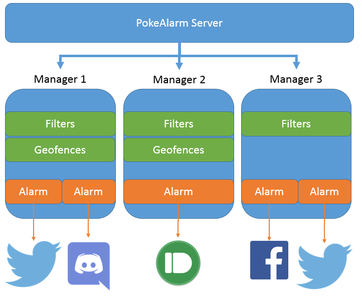

# Managers

## Overview

This guide will walk you through configuring server settings for PokeAlarm.

* [Prerequisites](#prerequisites)
* [Introduction](#introduction)
* [Multiple Managers](#multiple-managers)
* [Additional Options](#additional-options)
  * [Manager Names](#manager-names)
  * [Geofences](#geofences)
  * [Timezones](#timezones)

## Prerequisites

This guide assumes the following:

1. You have correctly [installed PokeAlarm](../getting-started/installation.html).

2. You are using Notepad++, Nano, or Vi(m) to configure any files. Do **NOT**
use or open any files with Notepad or TextEdit - they will break your files!

## Introduction

In PokeAlarm, a **Manager** is a grouping of different settings. Managers
allow you to configure multiple combinations of filters, alarms, geofences,
and other settings behind single webserver.



Webhooks are received by the PokeAlarm server, which then passes a copy to the
manager. Each Manager determines (independently)if the alert passes one of the
set filters (and geofence if enabled). If it does, the Manager sends the alert
to the alarm defined in the Alarms file.

PokeAlarm runs each Manager in a separate process, allowing each Manager to
operate in parallel and taking advantage of multiple cores.

## Multiple Managers

Managers can be configured using either the command line or the configuration
file. In order to run multiple managers, you must first set `manager_count`
equal to the number of mangers you want to run. Managers use the arguments of
a type in order. If only one argument (of a type) is provided, this argument
will be applied to all Managers. For example, the following command:

```
python start_pokealarm.py -m 3 -f common.json -f rares.json -f uncommon.json -a alarms.json
```

This command sets up three managers. The first uses the filter file
`common.json`, the second uses the `rares.json`, and the third uses the
`uncommon.json`. However, all three managers will use the same `alarms.json`
file to set up their alarms.

This same configuration can be accomplished via the following in the configuration file:

```ini
manager_count: 3
filters: [ common.json, rares.json, uncommon.json ]
alarms: alarms.json
```

## Additional Options

### Manager Names

Manager names are currently useful for logging purposes only. Changing the name
will change the name of the logger used in PA's output. Manager names are
configured the same as other parameters:

```ini
manager_name: [ manager_0, manager_1, manager_2 ]
```

If no manager name is defined, PA will name that manager automatically based on
it's order.

### Geofences

Geofences are a useful tool and can be bound in a mixture of combinations to
different managers. Configuring geofence files is similar to other options:

```ini
geofence: [ city1.json, none, city2.json ]
```

As you can see, you can mix managers with geofences and without by using `none`
for any managers that you don't want a geofence file loaded for.

You can find more information about Geofences on the [Geofences](geofences.html)
wiki page.

### Timezones

By default PA will use your server time for notifications. If you wish to
change this timezone, you can use either the `-tz` or `--timezone` to set a
timezone. A full list of compatible timezones can be found [here](https://en.wikipedia.org/wiki/List_of_tz_database_time_zones).
